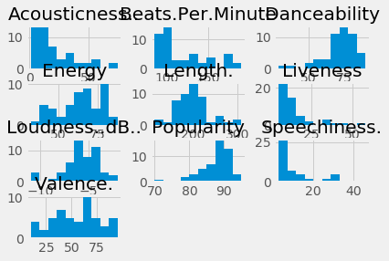
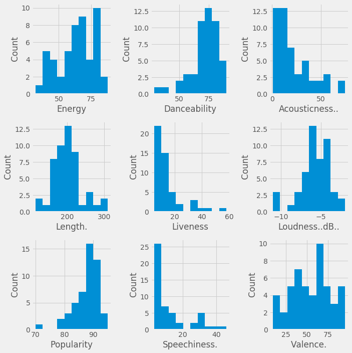
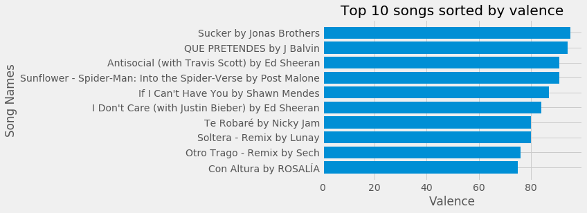
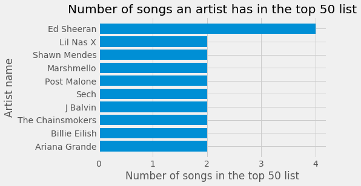

# Spotify-EDA-in-Python
## Data exploration of the top 50 listened to songs on Spotify.

# Summary of data:
* Data includes 13 features of the top 50 listened to songs on Spotify.
* Data was pooled worldwide; not just in the US.
* Each row represents a song on the top 50 list.
* Each column represents a feature of that song (e.g. beats per minute).
* No missing data.

```python
import pandas as pd
import numpy as np
import matplotlib.pyplot as plt
import scipy.stats as stats

plt.style.use("fivethirtyeight")
```


```python
df = pd.read_csv("Downloads/top50.csv", encoding='latin1', index_col=0)
```


```python
df.head()
```


<!-- <div>
<style scoped>
    .dataframe tbody tr th:only-of-type {
        vertical-align: middle;
    }

    .dataframe tbody tr th {
        vertical-align: top;
    }

    .dataframe thead th {
        text-align: right;
    } -->
<!-- </style> -->
<table border="1" class="dataframe">
  <thead>
    <tr style="text-align: right;">
      <th></th>
      <th>Track.Name</th>
      <th>Artist.Name</th>
      <th>Genre</th>
      <th>Beats.Per.Minute</th>
      <th>Energy</th>
      <th>Danceability</th>
      <th>Loudness..dB..</th>
      <th>Liveness</th>
      <th>Valence.</th>
      <th>Length.</th>
      <th>Acousticness..</th>
      <th>Speechiness.</th>
      <th>Popularity</th>
    </tr>
  </thead>
  <tbody>
    <tr>
      <td>1</td>
      <td>Señorita</td>
      <td>Shawn Mendes</td>
      <td>canadian pop</td>
      <td>117</td>
      <td>55</td>
      <td>76</td>
      <td>-6</td>
      <td>8</td>
      <td>75</td>
      <td>191</td>
      <td>4</td>
      <td>3</td>
      <td>79</td>
    </tr>
    <tr>
      <td>2</td>
      <td>China</td>
      <td>Anuel AA</td>
      <td>reggaeton flow</td>
      <td>105</td>
      <td>81</td>
      <td>79</td>
      <td>-4</td>
      <td>8</td>
      <td>61</td>
      <td>302</td>
      <td>8</td>
      <td>9</td>
      <td>92</td>
    </tr>
    <tr>
      <td>3</td>
      <td>boyfriend (with Social House)</td>
      <td>Ariana Grande</td>
      <td>dance pop</td>
      <td>190</td>
      <td>80</td>
      <td>40</td>
      <td>-4</td>
      <td>16</td>
      <td>70</td>
      <td>186</td>
      <td>12</td>
      <td>46</td>
      <td>85</td>
    </tr>
    <tr>
      <td>4</td>
      <td>Beautiful People (feat. Khalid)</td>
      <td>Ed Sheeran</td>
      <td>pop</td>
      <td>93</td>
      <td>65</td>
      <td>64</td>
      <td>-8</td>
      <td>8</td>
      <td>55</td>
      <td>198</td>
      <td>12</td>
      <td>19</td>
      <td>86</td>
    </tr>
    <tr>
      <td>5</td>
      <td>Goodbyes (Feat. Young Thug)</td>
      <td>Post Malone</td>
      <td>dfw rap</td>
      <td>150</td>
      <td>65</td>
      <td>58</td>
      <td>-4</td>
      <td>11</td>
      <td>18</td>
      <td>175</td>
      <td>45</td>
      <td>7</td>
      <td>94</td>
    </tr>
  </tbody>
</table>
</div>


#### What in the world is canadian pop??


```python
df[df['Genre'] == 'canadian pop']
```


<!-- <div>
<style scoped>
    .dataframe tbody tr th:only-of-type {
        vertical-align: middle;
    }

    .dataframe tbody tr th {
        vertical-align: top;
    }

    .dataframe thead th {
        text-align: right;
    }
</style> -->
<table border="1" class="dataframe">
  <thead>
    <tr style="text-align: right;">
      <th></th>
      <th>Track.Name</th>
      <th>Artist.Name</th>
      <th>Genre</th>
      <th>Beats.Per.Minute</th>
      <th>Energy</th>
      <th>Danceability</th>
      <th>Loudness..dB..</th>
      <th>Liveness</th>
      <th>Valence.</th>
      <th>Length.</th>
      <th>Acousticness..</th>
      <th>Speechiness.</th>
      <th>Popularity</th>
    </tr>
  </thead>
  <tbody>
    <tr>
      <td>1</td>
      <td>Señorita</td>
      <td>Shawn Mendes</td>
      <td>canadian pop</td>
      <td>117</td>
      <td>55</td>
      <td>76</td>
      <td>-6</td>
      <td>8</td>
      <td>75</td>
      <td>191</td>
      <td>4</td>
      <td>3</td>
      <td>79</td>
    </tr>
    <tr>
      <td>26</td>
      <td>If I Can't Have You</td>
      <td>Shawn Mendes</td>
      <td>canadian pop</td>
      <td>124</td>
      <td>82</td>
      <td>69</td>
      <td>-4</td>
      <td>13</td>
      <td>87</td>
      <td>191</td>
      <td>49</td>
      <td>6</td>
      <td>70</td>
    </tr>
  </tbody>
</table>
</div>


#### I guess canadian pop is not that big in the top 50.. Looks like only Shawn Mendes produces it. Let's see what else we're working with.


```python
df.columns
```


    Index(['Track.Name', 'Artist.Name', 'Genre', 'Beats.Per.Minute', 'Energy',
           'Danceability', 'Loudness..dB..', 'Liveness', 'Valence.', 'Length.',
           'Acousticness..', 'Speechiness.', 'Popularity'],
          dtype='object')


#### What do histograms of the quantitative columns look like?


```python
df.hist();
```





#### Let's use Matplotlib directly for this one as the Pandas histogram figure doesn't look very clear.


```python
fig, axs = plt.subplots(nrows=3,ncols=3, figsize=(10,10))
q_cols = ['Energy', 'Danceability', 'Acousticness..', 'Length.', 'Liveness', 'Loudness..dB..', 'Popularity', 'Speechiness.', 'Valence.']
for ax, col in zip(axs.flatten(), q_cols):
    ax.hist(df[col])
    ax.set_xlabel(col)
    ax.set_ylabel("Count")

plt.tight_layout();

```





#### Now we're talking.. This looks a lot more clear. It looks like most of the variables are heavily skewed either left or right. Only a few of the columns in here seem to have a normal distribution. That makes sense as they weren't randomly selected from the poulation; thus we wouldn't necessarily expect them to be normally distributed nor would we expect them to be representative of all songs. Let's look a little deeper into Valence which represents the degree to which the song portrays a positive mood.


```python
val_m = df['Valence.'].mean()
print(f"The mean value of valence from this dataset was: {val_m}")
print(f"The range of values valence took on in this dataset was from {df['Valence.'].min()} to {df['Valence.'].max()}")

```

    The mean value of valence from this dataset was: 54.6
    The range of values valence took on in this dataset was from 10 to 95


#### It would appear that valence might be rated on a scale from 0 to 100, but we cannot be sure. The only thing we can tell here is that songs in this dataset took on valence values from 10 to 95. I wonder what kind of songs were high in valence and what kind of songs are low in valence..

#### Top 10 valenced songs:


```python
df.sort_values('Valence.', ascending=False).head(10).reset_index()
```


<!-- <div>
<style scoped>
    .dataframe tbody tr th:only-of-type {
        vertical-align: middle;
    }

    .dataframe tbody tr th {
        vertical-align: top;
    }

    .dataframe thead th {
        text-align: right;
    }
</style> -->
<table border="1" class="dataframe">
  <thead>
    <tr style="text-align: right;">
      <th></th>
      <th>index</th>
      <th>Track.Name</th>
      <th>Artist.Name</th>
      <th>Genre</th>
      <th>Beats.Per.Minute</th>
      <th>Energy</th>
      <th>Danceability</th>
      <th>Loudness..dB..</th>
      <th>Liveness</th>
      <th>Valence.</th>
      <th>Length.</th>
      <th>Acousticness..</th>
      <th>Speechiness.</th>
      <th>Popularity</th>
    </tr>
  </thead>
  <tbody>
    <tr>
      <td>0</td>
      <td>39</td>
      <td>Sucker</td>
      <td>Jonas Brothers</td>
      <td>boy band</td>
      <td>138</td>
      <td>73</td>
      <td>84</td>
      <td>-5</td>
      <td>11</td>
      <td>95</td>
      <td>181</td>
      <td>4</td>
      <td>6</td>
      <td>80</td>
    </tr>
    <tr>
      <td>1</td>
      <td>30</td>
      <td>QUE PRETENDES</td>
      <td>J Balvin</td>
      <td>latin</td>
      <td>93</td>
      <td>79</td>
      <td>64</td>
      <td>-4</td>
      <td>36</td>
      <td>94</td>
      <td>222</td>
      <td>3</td>
      <td>25</td>
      <td>89</td>
    </tr>
    <tr>
      <td>2</td>
      <td>38</td>
      <td>Antisocial (with Travis Scott)</td>
      <td>Ed Sheeran</td>
      <td>pop</td>
      <td>152</td>
      <td>82</td>
      <td>72</td>
      <td>-5</td>
      <td>36</td>
      <td>91</td>
      <td>162</td>
      <td>13</td>
      <td>5</td>
      <td>87</td>
    </tr>
    <tr>
      <td>3</td>
      <td>18</td>
      <td>Sunflower - Spider-Man: Into the Spider-Verse</td>
      <td>Post Malone</td>
      <td>dfw rap</td>
      <td>90</td>
      <td>48</td>
      <td>76</td>
      <td>-6</td>
      <td>7</td>
      <td>91</td>
      <td>158</td>
      <td>56</td>
      <td>5</td>
      <td>91</td>
    </tr>
    <tr>
      <td>4</td>
      <td>26</td>
      <td>If I Can't Have You</td>
      <td>Shawn Mendes</td>
      <td>canadian pop</td>
      <td>124</td>
      <td>82</td>
      <td>69</td>
      <td>-4</td>
      <td>13</td>
      <td>87</td>
      <td>191</td>
      <td>49</td>
      <td>6</td>
      <td>70</td>
    </tr>
    <tr>
      <td>5</td>
      <td>6</td>
      <td>I Don't Care (with Justin Bieber)</td>
      <td>Ed Sheeran</td>
      <td>pop</td>
      <td>102</td>
      <td>68</td>
      <td>80</td>
      <td>-5</td>
      <td>9</td>
      <td>84</td>
      <td>220</td>
      <td>9</td>
      <td>4</td>
      <td>84</td>
    </tr>
    <tr>
      <td>6</td>
      <td>47</td>
      <td>Te Robaré</td>
      <td>Nicky Jam</td>
      <td>latin</td>
      <td>176</td>
      <td>75</td>
      <td>67</td>
      <td>-4</td>
      <td>8</td>
      <td>80</td>
      <td>202</td>
      <td>24</td>
      <td>6</td>
      <td>88</td>
    </tr>
    <tr>
      <td>7</td>
      <td>24</td>
      <td>Soltera - Remix</td>
      <td>Lunay</td>
      <td>latin</td>
      <td>92</td>
      <td>78</td>
      <td>80</td>
      <td>-4</td>
      <td>44</td>
      <td>80</td>
      <td>266</td>
      <td>36</td>
      <td>4</td>
      <td>91</td>
    </tr>
    <tr>
      <td>8</td>
      <td>14</td>
      <td>Otro Trago - Remix</td>
      <td>Sech</td>
      <td>panamanian pop</td>
      <td>176</td>
      <td>79</td>
      <td>73</td>
      <td>-2</td>
      <td>6</td>
      <td>76</td>
      <td>288</td>
      <td>7</td>
      <td>20</td>
      <td>87</td>
    </tr>
    <tr>
      <td>9</td>
      <td>45</td>
      <td>Con Altura</td>
      <td>ROSALÍA</td>
      <td>r&amp;b en espanol</td>
      <td>98</td>
      <td>69</td>
      <td>88</td>
      <td>-4</td>
      <td>5</td>
      <td>75</td>
      <td>162</td>
      <td>39</td>
      <td>12</td>
      <td>88</td>
    </tr>
  </tbody>
</table>
</div>

#### This data seems to make sense. Personally, I don't really recognize these songs but they seem to be poppy and boyband-ish. Those types of songs usually try to be pretty uplifting and happy.


#### Let's check out the lowest 10 valenced songs:

```python
df.sort_values('Valence.').head(10).reset_index()
```


<!-- <div>
<style scoped>
    .dataframe tbody tr th:only-of-type {
        vertical-align: middle;
    }

    .dataframe tbody tr th {
        vertical-align: top;
    }

    .dataframe thead th {
        text-align: right;
    }
</style> -->
<table border="1" class="dataframe">
  <thead>
    <tr style="text-align: right;">
      <th></th>
      <th>index</th>
      <th>Track.Name</th>
      <th>Artist.Name</th>
      <th>Genre</th>
      <th>Beats.Per.Minute</th>
      <th>Energy</th>
      <th>Danceability</th>
      <th>Loudness..dB..</th>
      <th>Liveness</th>
      <th>Valence.</th>
      <th>Length.</th>
      <th>Acousticness..</th>
      <th>Speechiness.</th>
      <th>Popularity</th>
    </tr>
  </thead>
  <tbody>
    <tr>
      <td>0</td>
      <td>15</td>
      <td>Money In The Grave (Drake ft. Rick Ross)</td>
      <td>Drake</td>
      <td>canadian hip hop</td>
      <td>101</td>
      <td>50</td>
      <td>83</td>
      <td>-4</td>
      <td>12</td>
      <td>10</td>
      <td>205</td>
      <td>10</td>
      <td>5</td>
      <td>92</td>
    </tr>
    <tr>
      <td>1</td>
      <td>16</td>
      <td>No Guidance (feat. Drake)</td>
      <td>Chris Brown</td>
      <td>dance pop</td>
      <td>93</td>
      <td>45</td>
      <td>70</td>
      <td>-7</td>
      <td>16</td>
      <td>14</td>
      <td>261</td>
      <td>12</td>
      <td>15</td>
      <td>82</td>
    </tr>
    <tr>
      <td>2</td>
      <td>5</td>
      <td>Goodbyes (Feat. Young Thug)</td>
      <td>Post Malone</td>
      <td>dfw rap</td>
      <td>150</td>
      <td>65</td>
      <td>58</td>
      <td>-4</td>
      <td>11</td>
      <td>18</td>
      <td>175</td>
      <td>45</td>
      <td>7</td>
      <td>94</td>
    </tr>
    <tr>
      <td>3</td>
      <td>34</td>
      <td>The London (feat. J. Cole &amp; Travis Scott)</td>
      <td>Young Thug</td>
      <td>atl hip hop</td>
      <td>98</td>
      <td>59</td>
      <td>80</td>
      <td>-7</td>
      <td>13</td>
      <td>18</td>
      <td>200</td>
      <td>2</td>
      <td>15</td>
      <td>89</td>
    </tr>
    <tr>
      <td>4</td>
      <td>7</td>
      <td>Ransom</td>
      <td>Lil Tecca</td>
      <td>trap music</td>
      <td>180</td>
      <td>64</td>
      <td>75</td>
      <td>-6</td>
      <td>7</td>
      <td>23</td>
      <td>131</td>
      <td>2</td>
      <td>29</td>
      <td>92</td>
    </tr>
    <tr>
      <td>5</td>
      <td>11</td>
      <td>Callaita</td>
      <td>Bad Bunny</td>
      <td>reggaeton</td>
      <td>176</td>
      <td>62</td>
      <td>61</td>
      <td>-5</td>
      <td>24</td>
      <td>24</td>
      <td>251</td>
      <td>60</td>
      <td>31</td>
      <td>93</td>
    </tr>
    <tr>
      <td>6</td>
      <td>43</td>
      <td>Shallow</td>
      <td>Lady Gaga</td>
      <td>dance pop</td>
      <td>96</td>
      <td>39</td>
      <td>57</td>
      <td>-6</td>
      <td>23</td>
      <td>32</td>
      <td>216</td>
      <td>37</td>
      <td>3</td>
      <td>87</td>
    </tr>
    <tr>
      <td>7</td>
      <td>36</td>
      <td>Summer Days (feat. Macklemore &amp; Patrick Stump ...</td>
      <td>Martin Garrix</td>
      <td>big room</td>
      <td>114</td>
      <td>72</td>
      <td>66</td>
      <td>-7</td>
      <td>14</td>
      <td>32</td>
      <td>164</td>
      <td>18</td>
      <td>6</td>
      <td>89</td>
    </tr>
    <tr>
      <td>8</td>
      <td>32</td>
      <td>7 rings</td>
      <td>Ariana Grande</td>
      <td>dance pop</td>
      <td>140</td>
      <td>32</td>
      <td>78</td>
      <td>-11</td>
      <td>9</td>
      <td>33</td>
      <td>179</td>
      <td>59</td>
      <td>33</td>
      <td>89</td>
    </tr>
    <tr>
      <td>9</td>
      <td>8</td>
      <td>How Do You Sleep?</td>
      <td>Sam Smith</td>
      <td>pop</td>
      <td>111</td>
      <td>68</td>
      <td>48</td>
      <td>-5</td>
      <td>8</td>
      <td>35</td>
      <td>202</td>
      <td>15</td>
      <td>9</td>
      <td>90</td>
    </tr>
  </tbody>
</table>
</div>

#### Once again, I'm not recognizing too many of these songs but several of them do seem to be a little less happy such as 'Goodbyes'.


```python
df_sortval = df.sort_values(by='Valence.', ascending=False).copy()
song_names = df_sortval['Track.Name'].head(10).values
artist_names = df_sortval['Artist.Name'].head(10).values
x = song_names + ' by ' + artist_names
x = x[::-1]
y = df_sortval['Valence.'].head(10)
y = y[::-1]
fig, ax = plt.subplots()

ax.barh(x, y)
ax.set_xlabel("Valence")
ax.set_ylabel("Song Names")
ax.set_title("Top 10 songs sorted by valence");

```





```python
gb = df.groupby('Artist.Name')[['Track.Name']].count().sort_values(by='Track.Name', ascending=False).head(10)
```


```python
y = gb.values.flatten()[::-1]
x = gb.index[::-1]
```


```python
fig, ax = plt.subplots()

ax.barh(x, y)
ax.set_xlabel("Number of songs in the top 50 list")
ax.set_ylabel("Artist name")
ax.set_title("Number of songs an artist has in the top 50 list");

```





```python

```
